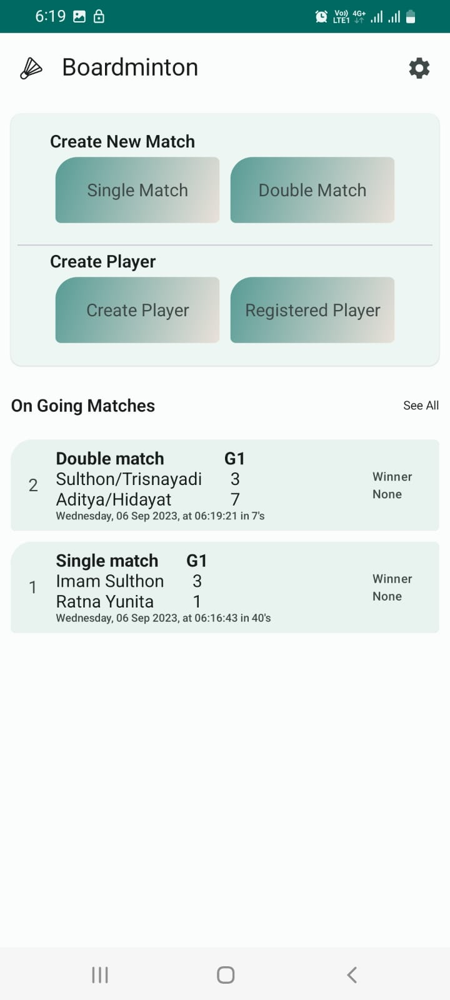
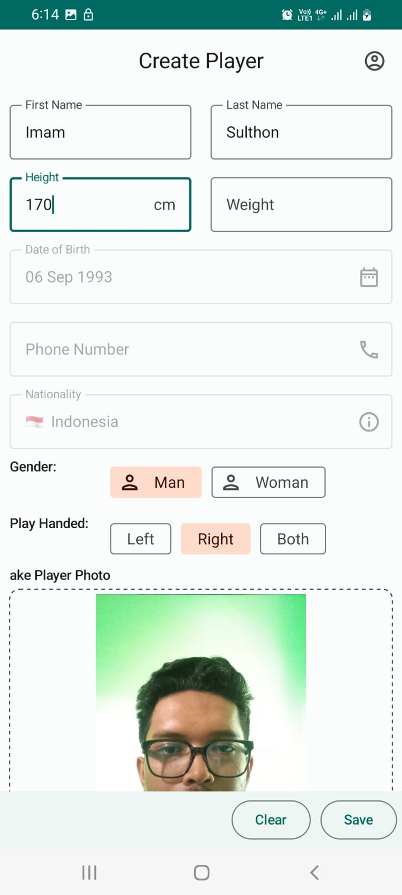
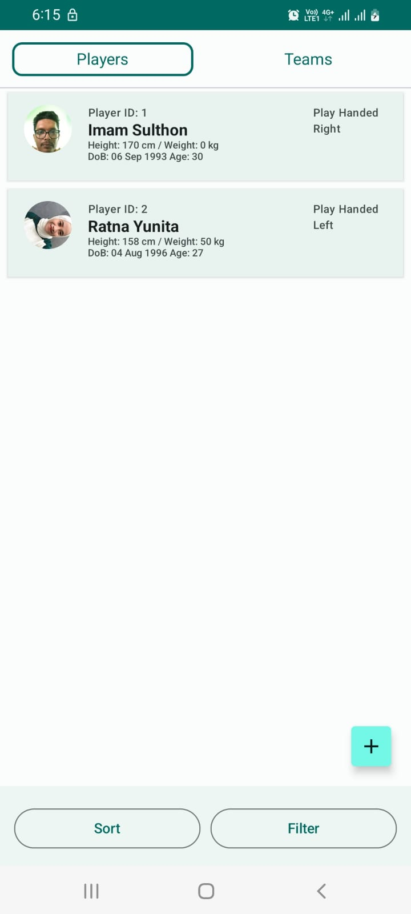
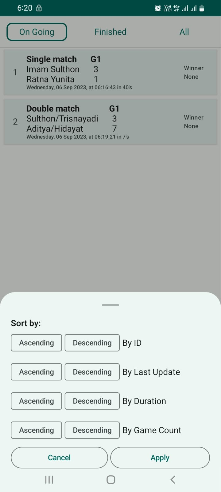
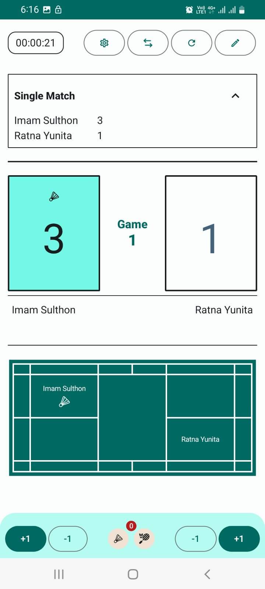
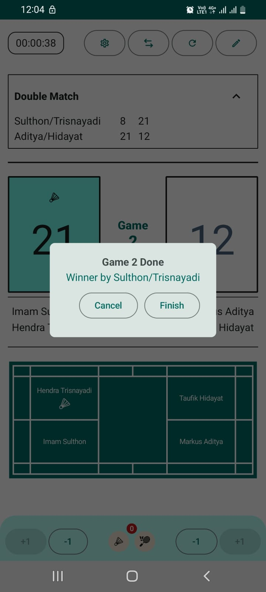

# Boardminton
Simple Board Score application for Badminton

Developer: Imam Sulthon

 
 

Libraries:
- [Hilt](https://dagger.dev/hilt/) - Hilt provides a standard way to incorporate Dagger dependency injection into an Android application.
- [Jetpack Compose](https://developer.android.com/jetpack/compose) - Jetpack Compose is Android’s recommended modern toolkit for building native UI. It simplifies and accelerates UI development on Android.
- [Coroutines](https://github.com/Kotlin/kotlinx.coroutines) - Library Support for coroutines.
- [Flows](https://developer.android.com/kotlin/flow)
  Flows are built on top of coroutines and can provide multiple values.
  A flow is conceptually a stream of data that can be computed asynchronously.

This App contains some page that following form task requirement
[Under developing]

